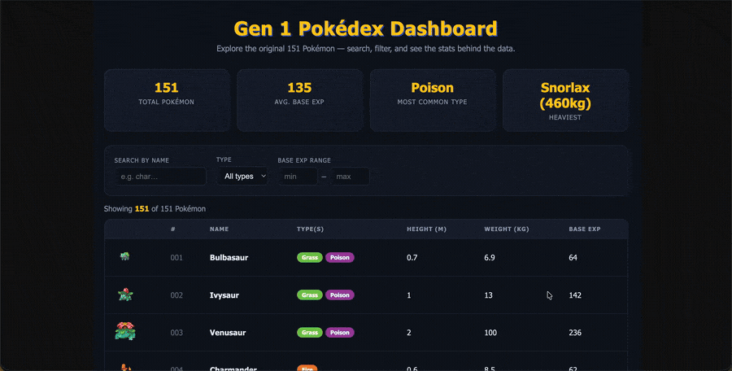

# Web Development Project - *Data Dashboard: Gen 1 Pokédex*

Submitted by: **Brayan Moafo**

This web app: **A data dashboard that fetches the original 151 Pokémon from the PokéAPI and presents them as an at-a-glance summary. It shows headline statistics about the dataset and a searchable, filterable list where every Pokémon is one row with its sprite, types, height, weight, and base experience.**

Time spent: **4** hours spent in total

## Required Features

The following **required** functionality is completed:

- [x] **The site has a dashboard displaying a list of data fetched using an API call**
  - [x] The dashboard displays at least 10 unique items, one per row (151 Pokémon)
  - [x] The dashboard includes at least two features in each row (sprite, #, name, type(s), height, weight, base exp)
- [x] **`useEffect()` React hook and `async/await` syntax are used**
- [x] **The app dashboard includes at least three summary statistics about the data**
  - [x] Total number of Pokémon (count)
  - [x] Average base experience (mean of a numeric attribute)
  - [x] Most common type (mode of a categorical attribute)
  - [x] *(bonus)* Heaviest Pokémon (max of a numeric attribute)
- [x] **A search bar allows the user to search for an item in the fetched data**
  - [x] The list only displays items matching the search query
  - [x] The list dynamically updates as the user types
- [x] **An additional filter allows the user to restrict displayed items by specified categories**
  - [x] The filter (Type dropdown) uses a different attribute than the search bar (name)
  - [x] The filter correctly restricts the displayed items
  - [x] The list dynamically updates as the filter changes

The following **optional** features are implemented:

- [x] Multiple filters can be applied simultaneously (name search + type + base-exp range all stack)
- [x] Filters use different input types (a text input, a dropdown, and numeric bounds)
- [x] The user can enter specific bounds for filter values (min/max base experience)

The following **additional** features are implemented:

* [x] Summary stats, filters, and the list are split into separate nested components
* [x] Loading and error states while the API data is being fetched
* [x] Color-coded type badges and a live "showing X of 151" result counter
* [x] All 151 details fetched in parallel with `Promise.all` for speed

## Video Walkthrough

Here's a walkthrough of implemented features:

<!-- Add your GIF here once recorded. GIF created with Kap (https://getkap.co/) -->

## Notes

The project uses **React + Vite** and the free, key-less [PokéAPI](https://pokeapi.co/).
The list endpoint only returns names and URLs, so the app first fetches the list of 151
Pokémon and then fetches each one's details in parallel with `Promise.all`, reshaping the
raw JSON into a small object per Pokémon. All filtering is done in a single `.filter()`
pass over the dataset so the search, type dropdown, and base-experience bounds combine
cleanly, and the results render with `.map()`.

## License

    Copyright 2026 Brayan Moafo

    Licensed under the Apache License, Version 2.0 (the "License");
    you may not use this file except in compliance with the License.
    You may obtain a copy of the License at

        http://www.apache.org/licenses/LICENSE-2.0

    Unless required by applicable law or agreed to in writing, software
    distributed under the License is distributed on an "AS IS" BASIS,
    WITHOUT WARRANTIES OR CONDITIONS OF ANY KIND, either express or implied.
    See the License for the specific language governing permissions and
    limitations under the License.
